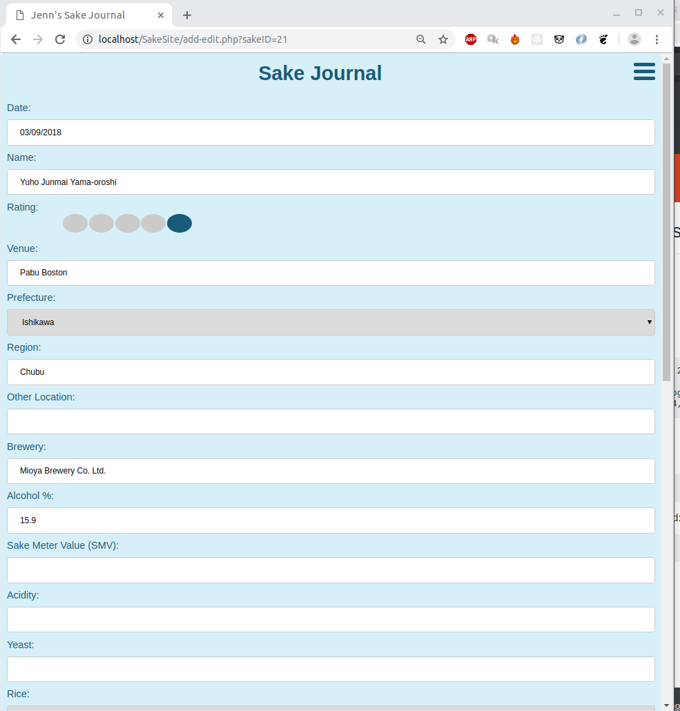
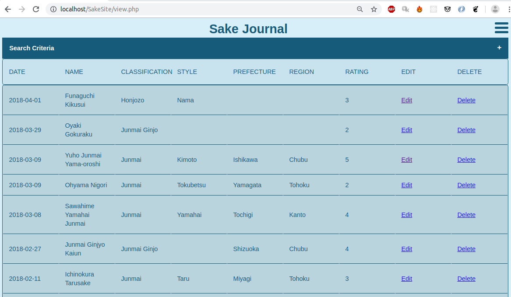
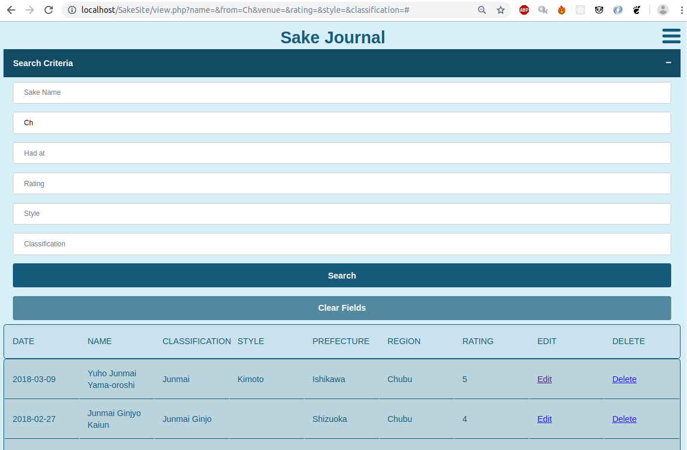
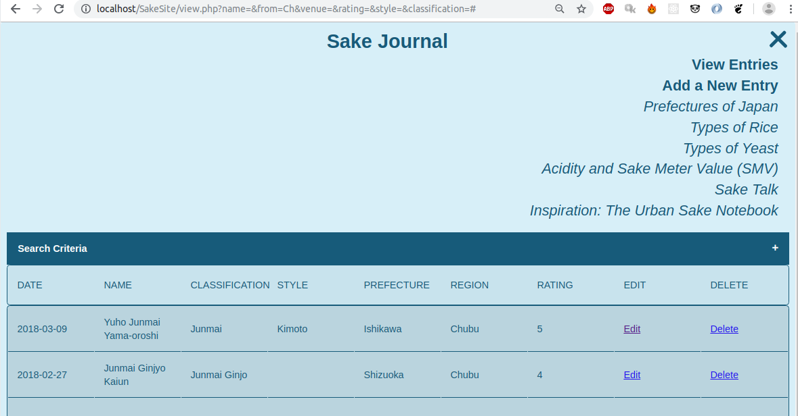

# Sake Journal

A php/MySQL web app to store and display my Sake drinking history and preferences.

## To Use

Add details about any Sake.

View/Edit/Delete any entries.

Filter the view list.

Expand the Navigation menu. (Italicized menu items open external sites in another window or tab).

## Future
- Add pics of vessels (hand-drawn? currently using placeholder images)
- Add ability to sort by column
- nicer rating icons (tiny stars are ugly)
- Make it prettier

## Installation
- Install php, the apache2 server, and phpmyadmin
- Download this repo to the C://var/www/html/ directory.
- Launch http://localhost/SakeSite/index.php in a web browser
